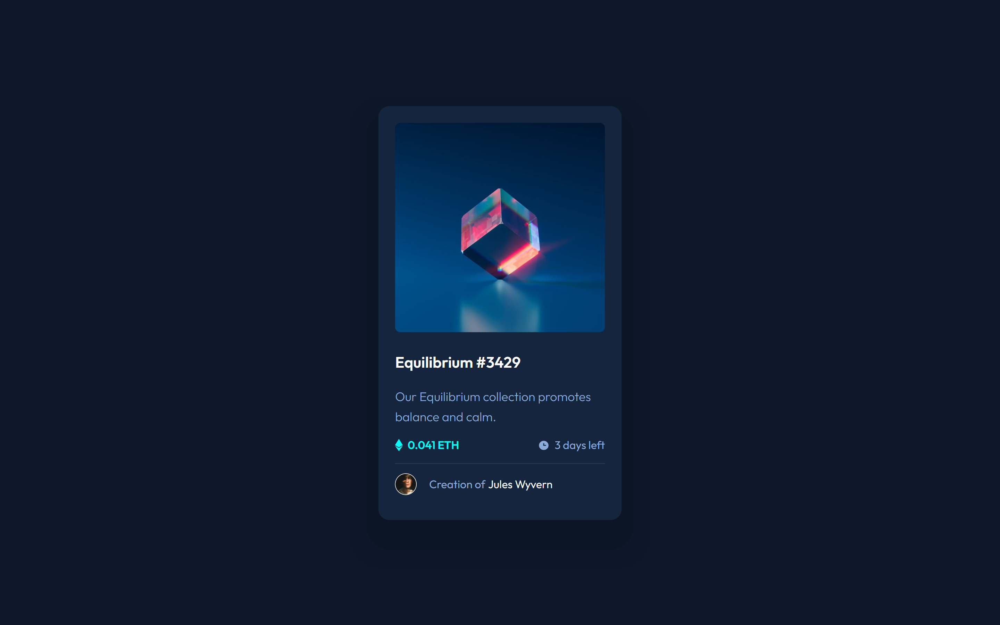

# Frontend Mentor - NFT preview card component solution

This is a solution to the [NFT preview card component challenge on Frontend Mentor](https://www.frontendmentor.io/challenges/nft-preview-card-component-SbdUL_w0U). Frontend Mentor challenges help you improve your coding skills by building realistic projects.

## Table of contents

- [Overview](#overview)
  - [The challenge](#the-challenge)
  - [Screenshot](#screenshot)
  - [Links](#links)
- [My process](#my-process)
  - [Built with](#built-with)
  - [What I learned](#what-i-learned)
  - [Useful resources](#useful-resources)
- [Author](#author)
- [Acknowledgments](#acknowledgments)

**Note: Delete this note and update the table of contents based on what sections you keep.**

## Overview

### The challenge

Users should be able to:

- View the optimal layout depending on their device's screen size
- See hover states for interactive elements

### Screenshot



### Links

- Solution URL: [Add solution URL here](https://your-solution-url.com)
- Live Site URL: [Add live site URL here](https://your-live-site-url.com)

## My process

### Built with

- Semantic HTML5 markup
- CSS custom properties
- Flexbox
- Data Attribute
- Mobile-first workflow

### What I learned

My main concern in this challenge was that I did not know how to change into the view icon when the card-image class was hovered.

```html
<div class="image">
  
  <div>
    
  </div>
</div>
```

```css
.image {
  position: relative;
}

.image > div {
  position: absolute;
  width: 100%;
  height: 100%;
  top: 0;
  background-color: hsla(178, 100%, 50%, 0.5);
  opacity: 0;
}

.image > div:hover {
  opacity: 1;
  cursor: pointer;
  border-radius: 8px;
}

.image > div > img {
  position: absolute;
  top: 50%;
  left: 50%;
  transform: translate(-50%, -50%);
}

.card-image {
  max-width: 278px;
  border-radius: 8px;
}
```

### Useful resources

- [box-shadow](https://developer.mozilla.org/en-US/docs/Web/CSS/box-shadow) - I did not know how box-shadow worked and now I did.
- [NFT preview card component | Frontend mentor challenge | HTML5 & CSS3](https://www.youtube.com/watch?v=88aBN3N45WA) - I straight-up went to his video and stole the image part. HAHA.

## Author

- Frontend Mentor - [@MikSanty](https://www.frontendmentor.io/profile/MikSanty)

## Acknowledgments

Thanks to Code Adam's YouTube video of this challenge.
Thanks to MDN web docs for providing me details with things I am currently lacking in knowledge.
